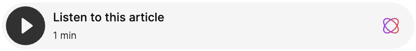

## Getting Started

To embed the player, copy this code snippet into the `<body>` of your site:

```html
<script async defer
  src='https://proxy.beyondwords.io/npm/@beyondwords/player@latest/dist/umd.js'
  onload='new BeyondWords.Player({ target: this, projectId: <ID>, contentId: "<ID>" })'>
</script>
```

Replace `<ID>` with your project's numeric ID and with your content's UUID.
You can find these in the BeyondWords CMS by clicking on the embed button next
to a published piece of content.

After refreshing the page, the player should load:


